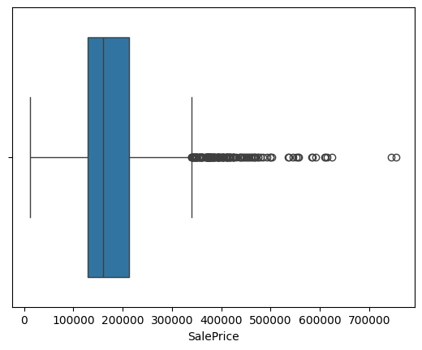
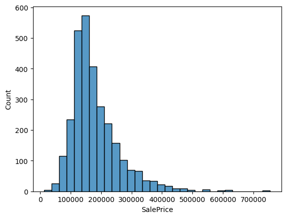
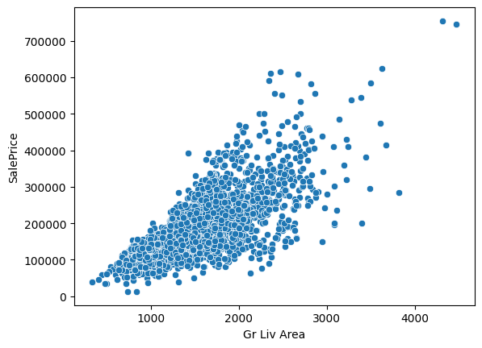
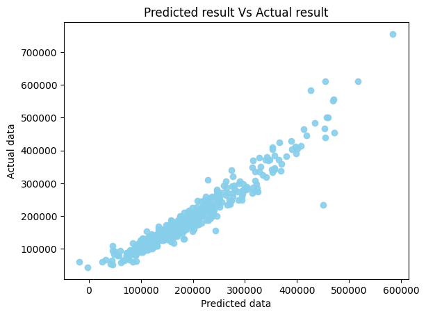

# house-price-prediction 

# House Price Prediction using Linear Regression

This project builds a **House Price Prediction Model** using **Linear Regression** in Python. The model predicts house prices based on various housing features such as living area, number of rooms, and other property characteristics. The project demonstrates the complete machine learning workflow including data preprocessing, exploratory data analysis, model training, evaluation, and saving the trained model for future use.

---

## Table of Contents
- [Project Overview](#project-overview)
- [Technologies Used](#technologies-used)
- [Dataset Preprocessing](#dataset-preprocessing)
- [Exploratory Data Analysis](#exploratory-data-analysis)
- [Model Training](#model-training)
- [Model Evaluation](#model-evaluation)
- [Model Visualization](#model-visualization)
- [Model Saving](#model-saving)
- [Project Structure](#project-structure)
- [How to Run the Project](#how-to-run-the-project)
- [Future Improvements](#future-improvements)
- [License](#license)

---

## Project Overview

The goal of this project is to develop a machine learning model capable of predicting **house sale prices** using housing data. The project follows a typical machine learning pipeline which includes cleaning and preprocessing the dataset, exploring the data through visualization, training a predictive model, evaluating its performance, and saving the trained model so it can be reused later without retraining.

---

## Technologies Used

- Python  
- Pandas  
- NumPy  
- Matplotlib  
- Seaborn  
- Scikit-learn  
- Joblib  

---

## Dataset Preprocessing

Several preprocessing steps were performed to prepare the dataset for modeling. Unnecessary columns that did not contribute to prediction were removed.

Removed columns:

- `Order`
- `PID`
- `House Style`
- `Garage Yr Blt`

The dataset was then divided into:

- **Features (X)** → Independent variables  
- **Target Variable (y)** → `SalePrice`

Categorical variables were converted into numerical form using **One-Hot Encoding** with `pd.get_dummies()`.

---

## Exploratory Data Analysis

Exploratory Data Analysis (EDA) was performed to understand the dataset and identify relationships between variables.

### Detecting Outliers

The boxplot below helps identify potential outliers in the **SalePrice** variable.



### Sale Price Distribution

The histogram below shows how **house sale prices are distributed** across the dataset.



### Living Area vs Sale Price

The scatter plot below shows the relationship between **ground living area** and **house sale price**.



---

## Model Training

The dataset was split into **training and testing sets** using an **80-20 split**. This ensures that the model is trained on one portion of the data and evaluated on unseen data.

A **Linear Regression** model from Scikit-learn was used for training. The model learns the relationship between the input features and the target variable (`SalePrice`) using the training dataset.

--- 

## Model Comparison

Several machine learning models were experimented with during this project to determine which model performs best on this dataset.

The following models were tested:

- Linear Regression
- Decision Tree Regressor
- Random Forest Regressor
- Polynomial Regression
- Support Vector Regression (SVR)

After comparing the performance metrics, **Linear Regression produced the best results for this dataset**, achieving the highest R² score and the most stable prediction performance.

Therefore, Linear Regression was selected as the final model for this project.

--- 

## Model Evaluation

After training the model, predictions were generated using the testing dataset. The performance of the model was evaluated using several commonly used regression metrics:

- **R² Score** – Measures how well the model explains the variance in the data  
- **Mean Absolute Error (MAE)** – Average absolute difference between predicted and actual values  
- **Root Mean Squared Error (RMSE)** – Square root of the average squared differences between predicted and actual values  

---

## Model Visualization

The scatter plot below compares the **predicted house prices** with the **actual house prices**. Points closer to a diagonal pattern indicate better prediction accuracy.



---

## Model Saving

The trained model and feature column names were saved using the **Joblib** library. Saving the model allows it to be reused later without retraining.

Saved model file:

```
houseprediction.pkl
```

This file contains the trained model and the feature columns used during training.

---

## Project Structure

```
house-price-prediction
│
├── image
│   ├── outliers.png
│   ├── distribution.png
│   ├── living_area_vs_price.png
│   └── predicted_vs_actual.png
│
├── house_price_prediction.ipynb
├── houseprediction.pkl
└── README.md
```

---

## How to Run the Project

1. Clone the repository:
   git clone https://github.com/sushil0126/house-price-prediction.git
2. Navigate to the project directory:
   cd house-price-prediction
3. Install required libraries:
   pip3 install pandas numpy matplotlib seaborn scikit-learn joblib
4. Run the Jupyter Notebook:
   jupyter notebook 

Open `house_price_prediction.ipynb` and run the cells to reproduce the results.

---

## Future Improvements

This project can be further improved by:

- Performing more advanced **feature engineering** to capture deeper relationships in the data
- Applying **hyperparameter tuning** to further improve model performance
- Using **cross-validation** for more robust model evaluation
- Implementing **feature importance analysis** to understand which variables influence house prices the most
- Deploying the model using **Flask**, **Streamlit**, or **FastAPI**
- Building a **web application** that allows users to input house features and predict prices in real time
- Creating an **interactive dashboard** for data visualization and model predictions

---

## License

This project is created for educational and learning purposes.
